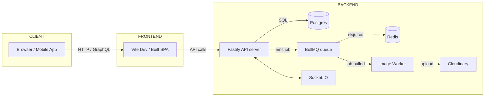
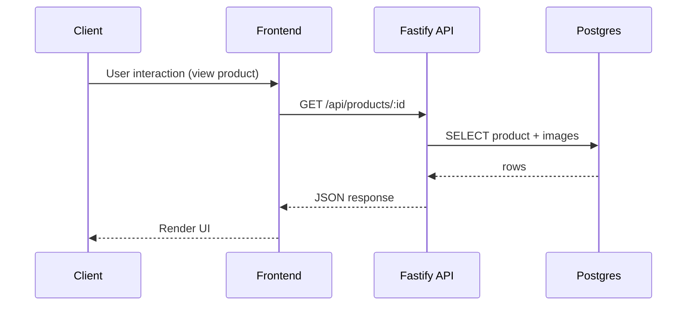
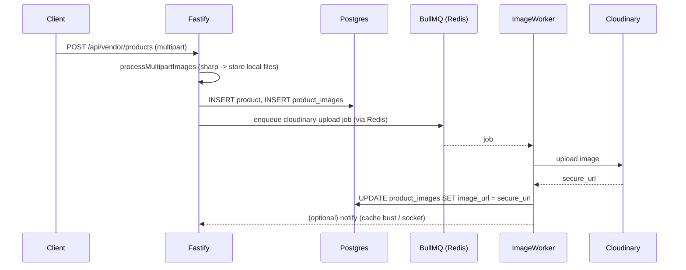
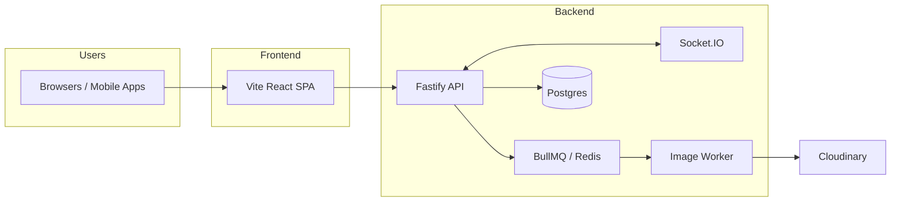

<!--- Auto-generated detailed architecture & blueprint for the project -->
# ARCHITECTURE: Detailed Blueprint, Biological Metaphors & Flow Diagrams

Last updated: 2026-04-19

Purpose
-------
- Provide an in-depth blueprint of the repository using a biological metaphor:
  - Skeletal system = core code and structural modules
  - Circulatory system = data flows, APIs, queues, and caches
  - Muscular system = workers, background processors and external integrations
- Provide flowcharts (Mermaid), system architecture, deployment notes, and an operational checklist.

Table of contents
-----------------
- Executive summary
- High-level system context (diagram)
- Skeletal system — core modules and responsibilities
- Circulatory system — data flows and sequences
- Muscular system — background workers, queues, and integrations
- Flowcharts & Mermaid diagrams
- Deployment, scaling & operational guidance
- Security, observability & failure modes
- Key files and where to look (quick map)
- Next steps and recommendations

Executive summary
-----------------
This repository is a web marketplace-style app with two main surfaces:

- Frontend: Vite + React (dev server at :5173, build outputs under `frontend/dist` when built)
- Backend: Node.js Fastify app (server entry: `backend/server.js`) with PostgreSQL, optional Redis+BullMQ for background queues, Cloudinary for image hosting, and Socket.IO for realtime chat.

The document below maps the topology of the project to a biological analogy to make reasoning about responsibilities, failure modes and improvements easier.

High-level system context (diagram)
----------------------------------



Skeletal system — core modules and responsibilities
--------------------------------------------------

This section lists the key structural pieces of the codebase (the "bones") and what they hold up.

- `backend/server.js` — app bootstrap
  - Initializes Fastify, registers routes and plugins, attaches Socket.IO, connects DB and starts background worker.
  - Important: the server uses `fastify.listen()` to bind the internal HTTP server.

- `backend/routes/*.js` — HTTP endpoints organized by domain
  - `auth.js` — authentication, tokens, user endpoints
  - `vendor.js` — vendor product management endpoints (create/update/delete products, sales reports)
  - `products.js`, `listings.js`, `search.js`, `chat.js`, `personalization.js`, `shopper.js`
  - Each file exports a Fastify plugin (async function) that registers routes.

- `backend/utils/` — shared helpers and cross-cutting utilities
  - `index.js` — DB pool and helpers (postgres Pool configuration)
  - `auth.js` — token generation, refresh token store, password checks
  - `cache.js` — caching helpers used across products/routes
  - `aiHooks.js` — hooks that call background AI / event logic

- `backend/middleware` — request-level helpers
  - `upload.js` — multipart handling, image processing (sharp), local file storage, and enqueueing image upload jobs.

- `backend/queues` & `backend/workers` — job system
  - `backend/queues/imageQueue.js` — BullMQ queue wrapper, `enqueueCloudinaryUpload()` and `getImageQueue()`
  - `backend/workers/imageWorker.js` — worker that uploads to Cloudinary and updates DB

- `frontend/` — React + Vite codebase
  - `src/api/` — client API helpers
  - `src/components/` — UI components including vendor manager, product cards, chat UI

Circulatory system — data flows and sequences
--------------------------------------------

The circulatory system describes how data moves through the app (requests, DB, queues).

1) Typical read request (browse, product detail)

   Client -> Frontend -> Fastify Route Handler -> DB (SELECT) -> Response -> Frontend -> Client

   - Caching: `utils/cache.js` can store responses; lookups occur before DB in some flows.

2) Image upload (two-phase flow):

   Client (multipart upload) -> Fastify `processMultipartImages()` (middleware/upload.js)
     - Sharp resizes to local WebP files under `uploads/products/`
     - Product rows and product_images rows are created in DB
     - Enqueue an upload job with `enqueueImageUploads()` which uses `queues/imageQueue.js`

   Queue (BullMQ via Redis) -> Worker (`workers/imageWorker.js`) picks up job
     - Worker uploads to Cloudinary (if configured) and updates `product_images.image_url`
     - Worker deletes local files on success

   If Redis / BullMQ unavailable, `enqueueImageUploads()` attempts a sync Cloudinary fallback (best-effort) and logs warnings.

3) Realtime chat

   Client <-> Socket.IO (Server) — messages are broadcast to rooms, persisted to DB by backend socket handlers.

4) Background tasks / views

   `server.js` schedules materialized view refreshes (setInterval) — these are slow but scheduled maintenance tasks that feed analytics endpoints.

Muscular system — workers, schedulers, and external integrations
----------------------------------------------------------------

- Image Worker
  - Location: `backend/workers/imageWorker.js`
  - Pulls jobs from BullMQ `image-processing` queue and uploads images to Cloudinary.

- Queueing
  - Location: `backend/queues/imageQueue.js`
  - Depends on Redis; gracefully degrades when Redis is not reachable.

- AI hooks & background triggers
  - `utils/aiHooks.js` contains the actions invoked by `onProductMutated` and `onSaleRecorded` which may call external AI services or schedule background processes.

- DB (Postgres)
  - Stores core domain data: products, product_images, users, vendors, sales_reports, chat tables.

Flowcharts & Mermaid diagrams
----------------------------

1) Request handling flow



2) Image upload sequence



3) System architecture (component diagram)



Deployment, scaling & operational guidance
-----------------------------------------

Recommended production topology

- Run services in containers (Docker) or orchestrate with Kubernetes / ECS.
- Services:
  - `backend` (multiple replicas behind load balancer)
  - `frontend` (statically built assets served by CDN)
  - `postgres` (managed DB or HA cluster)
  - `redis` (for BullMQ; highly available Redis or managed service)
  - `image-worker` (scaleable pool reading from BullMQ)

Ports & env

- Backend: `PORT` (default 3001)
- DB env: `DB_HOST`, `DB_PORT`, `DB_USER`, `DB_PASSWORD`, `DB_NAME`
- Redis: `REDIS_URL`
- Cloudinary: `CLOUDINARY_CLOUD_NAME`, `CLOUDINARY_API_KEY`, `CLOUDINARY_API_SECRET`
- JWT secrets: `JWT_SECRET` / `ACCESS_TOKEN_SECRET`

Scaling notes

- Fastify: stateless; increase replicas and place behind LB. Use sticky sessions only if needed for Socket.IO (or run socket layer separately with adapter).
- Workers: scale horizontally by increasing worker count; ensure concurrency tuned (sharp/Cloudinary CPU and network).
- Redis: single point for queueing — use managed or highly available Redis.

Observability & reliability

- Logging: use structured logging (pino) and centralize to ELK / Loki.
- Metrics: export process metrics (Prometheus) and track queue depths and worker failures.
- Health & readiness: `GET /health` exists; extend with readiness that checks Redis and optional external dependencies.
- Alerts: queue backlog, failed job rate, DB connection failures.

Security & privacy
------------------

- Authentication: JWT tokens enforced by `fastify.decorate('authenticate', ...)`.
- Validate and sanitize all user inputs (`xss` usage present). Keep strict file-size limits and whitelist MIME types on uploads.
- Consider rate-limits (already registered via `@fastify/rate-limit`) and additional WAF if exposed publicly.

Failure modes and graceful degradation
------------------------------------

- Redis down: queue operations should degrade — we've added code to detect Redis availability and fall back to synchronous Cloudinary uploads where possible. Ensure fallback paths are tested.
- Cloudinary down: workers will fail; image files will remain local — provide a cron to retry uploads and a cleanup policy for local files.
- DB down: app currently detects DB connection and may run in demo mode (some endpoints return mocked data). Track DB downtime separately and notify.

Key files and where to look (quick map)
--------------------------------------

- App bootstrap: `backend/server.js`
- DB + utils: `backend/utils/index.js`, `backend/utils/*`
- Routes: `backend/routes/*.js` (`auth.js`, `vendor.js`, `products.js`, `chat.js`, `search.js`)
- Upload + image path: `backend/middleware/upload.js`
- Queue wrapper: `backend/queues/imageQueue.js`
- Worker: `backend/workers/imageWorker.js`
- Frontend entry: `frontend/src/main.tsx`, component tree in `frontend/src/components/`

Operational runbook (quick commands)
-----------------------------------

Start dev frontend:

```bash
cd frontend
npm install
npm run dev
```

Start backend (dev):

```bash
cd backend
npm install
npm run dev    # uses nodemon
```

Start Redis (docker):

```bash
docker run -d --name redis -p 6379:6379 redis:7-alpine
```

Start worker (standalone):

```bash
cd backend
node workers/imageWorker.js
```

Checklist for production readiness
----------------------------------

 - [ ] Centralized logs
 - [ ] Metrics + alerts (Prometheus / Grafana)
 - [ ] Managed Redis and Postgres
 - [ ] CI for builds and tests
 - [ ] Secrets management (don't commit `.env`)
 - [ ] Security review for upload and token flows

Next steps & recommendations
----------------------------

1. Add an integration test for the upload -> queue -> worker path (simulate Redis down and up).
2. Add health checks for Redis and Cloudinary and expose readiness endpoints.
3. Add a small dashboard to monitor BullMQ queue depth and failed jobs.
4. Consider using a Socket.IO adapter (Redis adapter) when scaling Socket.IO across multiple backend instances.
5. Document operational handoffs in `README.md` or `docs/` for runbooks and incident response.

Appendix: Quick mapping (short)
-----------------------------

- Web client: `frontend/` (React + hooks + components)
- API server: `backend/server.js` and `backend/routes/*`
- Shared helpers: `backend/utils/*`
- Queue: `backend/queues/imageQueue.js` (Redis + BullMQ)
- Worker: `backend/workers/imageWorker.js` (Cloudinary)

-- End of blueprint --
